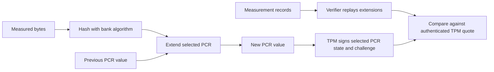

# PCR measurements and prediction for non-UKI A/B boot



This reference accompanies the [boot and migration design](systemd-boot-ab.md). It distinguishes conventional PCR allocations, the components that actually extend PCRs in this implementation, and what `pcrsys` predicts. A missing prediction is **unknown**, not zero. A value returned by the predictor is a model output, not an attestation result. <sup>[1][2][3]</sup>

The source baseline is Twoliter `6074c7b9f77d65dcdd51a55edcc63b3edb3bc8f4`, core-kit `6213c4831e4bd67b96870ce17bc7af90e4049613`, kernel-kit `9b352755f73530a70e058b33d2ddd05909417993`, systemd 257.13 and the Linux 6.18.48 firmware fixture. The generic Linux registry describes additional software and newer behavior; those entries do not imply that this Bottlerocket path runs those components. <sup>[1][4][5][9]</sup>

## What a PCR tells you

A TPM PCR accumulates measurements in a hash chain. For one hash bank, an extension has the form `new = H(old || event_digest)`. Order and the exact measured bytes matter. A SHA-256 bank and a SHA-384 bank have different values even for the same event stream. Firmware separators, PE Authenticode digests, raw-file hashes and strings with different encodings are not interchangeable. <sup>[2][3][4][5]</sup>

Secure Boot verifies whether executable content is accepted by a trust policy. Measured boot records digests. A TPM quote authenticates selected PCR state with a freshness challenge; verification also needs a trusted attestation key, expected policy and sufficient measurement evidence. Merely reading a PCR or matching one predicted digest does not prove the machine booted the intended software. An event log explains extensions only when it contains all relevant events and agrees with authenticated PCR state. <sup>[1][10]</sup>

## PCR-by-PCR reference

PCRs 0–7 are firmware-oriented allocations; 8–15 are used by the OS ecosystem. The table's role column is descriptive, not an exclusive assignment that prevents other code from extending a register. PCRs 16–23 are outside this loader's measurement/prediction model; this document does not qualify a dynamic-root-of-trust launch. <sup>[1][2][10]</sup>

| PCR | Conventional role / relevant producer | This Bottlerocket path and predictor |
| --- | --- | --- |
| 0 | Core platform firmware code. | Predictor returns a hard-coded AWS value; omits VMware/metal. This is an implementation assumption, not a guarantee for all firmware revisions. |
| 1 | Platform configuration, potentially machine-specific firmware data. | Separator-only prediction on VMware; omitted on AWS/metal. |
| 2 | Extended firmware/option-ROM code. | The dedicated loader explicitly measures its ext4 driver. Prediction omitted on this path; legacy AWS/VMware model is separator-only, metal omitted. |
| 3 | Extended firmware configuration. | AWS/VMware separator-only prediction; metal omitted. |
| 4 | Boot executable chain, including loaded PE images. | A/B prediction omitted. The actual chain differs for a direct new-bank boot and a legacy delegation. |
| 5 | Boot configuration, notably GPT; firmware may also measure boot variables. | AWS/metal A/B model returns 72 candidate values. VMware omitted. Candidates are not a model of arbitrary NVRAM state. |
| 6 | Firmware-reserved/profile-dependent behavior, commonly resume-related. | AWS/VMware separator-only prediction; metal omitted. No resume qualification was performed. |
| 7 | Secure Boot policy and signing authorities; shim policy events may contribute. | Omitted for the dedicated loader. Legacy prediction models a specific variable/authority sequence. |
| 8 | Linux ecosystem use includes GRUB commands; this OS uses settings measurements. | Rottweiler measures raw IMDS user data and canonicalized settings when its TPM-gated units run. No pcrsys module/prediction. |
| 9 | Linux EFI initrd measurements; other loaders/OS code also use it. | Linux EFI measures load options and LoadFile2 payload; full Bottlerocket later measures `/proc/cmdline`. A/B prediction omitted. |
| 10 | IMA runtime measurements. | Predictor returns zero. This is an assumption of its model, not a claim that PCR 10 is universally unused. |
| 11 | UKI contents and boot phases in the broader systemd ecosystem. | This non-UKI path uses rottweiler boot-phase strings. Predictor returns seven cumulative phase states starting from zero. No UKI section measurement is implied. |
| 12 | Kernel configuration, including systemd load options. | Dedicated loader measures UTF-16 load options; prediction omitted. Legacy model returns zero. |
| 13 | System-extension/initrd-extension measurements in the systemd ecosystem. | Predictor returns zero; no extension-image qualification in this task. |
| 14 | Shim Machine Owner Key (MOK) policy. | Dedicated-loader prediction omitted because shim paths can differ; legacy model extends MOK-related data. |
| 15 | System identity, filesystem identity or volume-key measurements in the systemd ecosystem. | Predictor returns zero; this does not establish an encrypted-storage policy. |
| 16 | Debug use. | No measurement producer added by this task; no predictor. |
| 17 | Dynamic-root-of-trust (DRTM) PCR; the reference platform permits extensions from TPM localities 2–4. | No predictor; no DRTM validation. |
| 18 | DRTM PCR; the reference platform permits extensions from TPM localities 2–4. | No predictor; no DRTM validation. |
| 19 | DRTM PCR; the reference platform permits extensions from TPM localities 2–3. | No predictor; no DRTM validation. |
| 20 | DRTM PCR; the reference platform permits extensions from TPM localities 1–3. | No predictor; no DRTM validation. |
| 21 | Dynamic OS PCR; the reference platform permits extensions from TPM locality 2. | No predictor; no DRTM validation. |
| 22 | Dynamic OS PCR; the reference platform permits extensions from TPM locality 2. | No predictor; no DRTM validation. |
| 23 | Application support. | No measurement producer added by this task; no predictor. |

Generic roles come from the Linux PCR registry and systemd's definitions (including its explicit PCR 16 debug and PCR 23 application-support rows); concrete outputs come from each `pcrsys/src/pcrs/pcrN.rs` module. The producer details below are based on the pinned loader, kernel and OS sources. PCR 6 is deliberately not assigned a more specific, unverified platform meaning. PCRs 17–22 use the pinned TPM reference platform as an illustration, not a claim about a tested Bottlerocket TPM. <sup>[1][2][3][4][5][6][11]</sup>

TPM localities distinguish request origins for privileged operations. In the reference platform, PCRs 17–22 have different reset/extend permissions from static PCRs and initially contain all-one bytes, rather than the zero starting value used by the static prediction model. Its source explicitly notes differences from the PC Client specification for PCRs 20–22. Software using these registers must consult its actual TPM/platform profile; this loader performs no DRTM launch. <sup>[11]</sup>

## Exact producers that matter to this change

### PCR 2: authenticated ext4 driver

The systemd patch measures the exact buffered EFI driver before execution using a tagged event: tag `0x53594452`, description `systemd EFI driver`, PCR 2. The digest covers the **raw driver buffer**, not a PE Authenticode digest. This explicit event covers a path where firmware may omit its own measurement after rejecting an image that shim's vendor policy subsequently accepts. Firmware may also contribute events, so a single-event static prediction would be unsafe. <sup>[4]</sup>

### PCRs 4, 7 and 14: executable path and trust policy

PCR 4 depends on which EFI applications execute, including retained legacy shim/GRUB when the selected bank lacks a manifest. PCR 7 depends on firmware policy, authorities and shim policy events; PCR 14 depends on MOK processing. Valid signatures do not make the resulting values identical across those paths. The dedicated-loader model omits all three. <sup>[2][4][7]</sup>

For legacy images, pcrsys models PCR 7 from SecureBoot, PK, KEK, db, dbx, a separator, signing-authority data, SbatLevel and MokListRT. It includes platform-specific assumptions about signature-owner fields and certificate selection. Legacy PCR 14 is built from MOK certificate data, an empty SHA-256 MOK exclusion list and the trusted-MOK flag. These are source-specific prediction rules, not universal descriptions of every shim build or firmware. <sup>[2]</sup>

### PCR 5: a bounded GPT candidate set

For AWS/metal A/B images, pcrsys varies PRIVATE bit 57 over two states and each BOOT partition over six `(priority, tries, successful)` combinations:

```text
(0,0,false) (0,1,false) (1,0,true)
(2,0,false) (2,0,true)  (2,1,false)
```

It recalculates GPT CRCs, hashes the resulting EFI_GPT_DATA representation, and models the sequence separator → GPT digest → `Exit Boot Services Invocation` → `Exit Boot Services Returned with Success`. Thus the A/B result has `2 × 6 × 6 = 72` candidates; a single bank has 12. VMware is omitted because its modeled firmware boot variables include instance-specific device paths. This set does not cover every representable GPT attribute combination or every platform's boot-variable events. Installed migration changes NVRAM, so retaining the candidate set does not qualify migrated machines. <sup>[2]</sup>

### PCR 8: user data and settings

Rottweiler hashes raw IMDS user data with explicit domain separation. Present data uses the bytes `ec2-imds-user-data:v1:` followed by the unmodified data; absent data uses `ec2-imds-user-data:v1:absent`. Empty, present user data remains distinct from absent data. It does not trim, decode or decompress the user data before measurement. <sup>[6]</sup>

This framing is not an unambiguous presence encoding for every possible payload: present raw bytes `absent` produce the same input as the absent marker. A verifier must not infer absence solely from that digest. This is existing rottweiler behavior, not a guarantee added by the loader. <sup>[6]</sup>

Settings measurement hashes the actual output of:

```text
apiclient get settings --exclude settings.updates.seed --exclude settings.network.hostname --canonicalize
```

The excluded fields would otherwise introduce per-instance variability. The user-data unit runs before early configuration/application; the settings unit runs after settings application and before bootstrap commands. These are TPM-gated units. Their data cannot be derived from the disk image alone, and pcrsys does not predict PCR 8. <sup>[6]</sup>

### PCR 9: EFI inputs and the OS command line

The tested Linux EFI stub records tagged PCR 9 events for its load options and the LoadFile2 initrd payload. Here the latter is the validated bootconfig envelope, with no executable initramfs prefix. For load options, Linux hashes the exact `LoadOptionsSize` bytes before its compatibility adjustment; this loader supplies `(strlen16(options) + 1) * sizeof(char16_t)`, including the NUL. For initrd, Linux hashes `initrd.size` bytes only when the size is nonzero. Hashing a human-readable command line or just the bootconfig text is not a substitute. <sup>[4][5]</sup>

Full Bottlerocket adds another contribution: `measure-cmdline.service`, gated on a TPM and a non-UKI image, runs rottweiler before sysinit. It hashes the exact `/proc/cmdline` bytes, including its newline. Therefore the **two PCR 9 events in the minimal Linux TPM fixture are not the final full-OS PCR 9 history**. The legacy single-bank predictor models a final command line plus newline; A/B images omit PCR 9 because selected-bank parameters vary. <sup>[2][5][6][9]</sup>

### PCR 11: OS phases

Rottweiler extends phase strings as SHA-256/SHA-384/SHA-512 digests through `tpm2_pcrextend`. The release units define the sequence:

```text
sysinit → preconfigured → configured → ready → shutdown → final
```

Pcrsys returns zero plus the six cumulative SHA-256 prefix states: seven possible values. The predictor assumes a zero starting value and that phase sequence; it does not account for unexpected extra writers. This dedicated non-UKI loader does not measure UKI sections into PCR 11, even though systemd-stub uses PCR 11 for that purpose on other boot paths. A policy must select the intended phase, rather than treating all returned candidates as equally appropriate for releasing a secret. <sup>[2][6]</sup>

The pinned Bottlerocket systemd package excludes upstream `systemd-pcr*` units, `systemd-tpm2-setup`, `systemd-pcrextend` and the shipped `pcrlock.d` definitions. Bottlerocket supplies its rottweiler-backed phase units separately. Do not import the generic registry's complete userspace event set, including newer `os-separator` behavior, into this build's model. These packaging choices still do not prove that no other code can extend a zero-predicted PCR. <sup>[6]</sup>

### PCR 12: systemd load options

`br-load.c` calls `tpm_log_load_options` before the Linux handoff. In **systemd 257.13**, that helper uses `strsize16(load_options)`, so the measured UTF-16 buffer includes its terminating NUL. This source behavior differs from the upstream v257 narrative that says no trailing NUL; the pinned implementation and fixture take precedence for reproducing this build. This is separate from Linux's own PCR 9 load-options event. Pcrsys omits PCR 12 on the dedicated-loader path. <sup>[2][4][8][9]</sup>

## Prediction boundaries during installed migration

Pcrsys detects the dedicated loader by inspecting **EFI-A** for its Bottlerocket-specific `LoaderInfo` marker. It rejects an unrecognized systemd loader rather than silently applying this model. It does not inspect live BootOrder/BootNext to determine the loader actually selected by firmware. <sup>[3]</sup>

An installed migration deliberately preserves legacy EFI-A and boots new EFI-B through NVRAM. Consequently the offline detector can identify that disk as legacy even when firmware selects the new loader. Its current behavior is useful for the fresh image format, but it is not a complete predictor for installed transition states. Bank choice, firmware path and boot phase must be part of any later policy qualification. <sup>[3][7]</sup>

Zero outputs for PCRs 10, 13 and 15 remain implementation assumptions. Omitted PCRs 2, 4, 7, 9, 12 and 14 must not be filled with zero or copied from legacy predictions. The existing rottweiler policy selects PCRs 7/11/14 for in-place updates and 4/7/9/11/14 otherwise; the feature excludes encrypted storage, so this task does not validate a new sealing or key-rotation design. <sup>[1][2][6]</sup>

## Evidence, replay and unresolved qualification

The separate local software-TPM fixture observed the explicit driver PCR 2 event, two Linux PCR 9 tagged events and the systemd PCR 12 load-options event. The full Bottlerocket updog round trip used Secure Boot but **no virtual TPM**. Thus the test proves the recorded fixture event behavior and the installed migration separately; it does not prove their combination on a production platform. No full-OS TPM quote or complete final-PCR comparison was validated. <sup>[9]</sup>

Rottweiler's measurements invoke `tpm2_pcrextend`; these calls do not append records to the firmware event log in this implementation. Firmware-log replay alone therefore cannot reconstruct later PCR 8, 9 or 11 extensions. A complete verifier would need separately authenticated/reconcilable evidence for those userspace contributions as well as the firmware log and quote. This is a remaining integration requirement, not an existing end-to-end attestation service delivered by the loader change. <sup>[6][9][10]</sup>

## Conflicts resolved

The former pcrsys README incorrectly omitted PCR 5 for all A/B images and called zero-predicted registers unused. This reference corrects both statements. It also records the source/narrative discrepancy for PCR 12's NUL byte and distinguishes minimal-fixture PCR 9 from full-OS measurements. Platform PCR 6 and dynamic-launch PCRs 17–22 remain outside the verified scope. <sup>[2][8][9]</sup>

## Sources

<sup>[1]</sup> [Linux TPM PCR Registry](https://uapi-group.org/specifications/specs/linux_tpm_pcr_registry/), consulted 2026-09-25; [systemd v257.13 PCR definitions](https://github.com/systemd/systemd/blob/v257.13/man/systemd-cryptenroll.xml); [image feature validation](../../tools/buildsys/src/manifest.rs).

<sup>[2]</sup> [PCR modules](../../tools/pcrsys/src/pcrs), especially `pcr5.rs`, `pcr7.rs`, `pcr9.rs`, `pcr11.rs` and `pcr14.rs`; [extension and record types](../../tools/pcrsys/src/predict.rs).

<sup>[3]</sup> [Disk/loader detection](../../tools/pcrsys/src/diskfs.rs).

<sup>[4]</sup> Core-kit [dedicated loader patch](http://127.0.0.1:3000/jepiyush/bottlerocket-core-kit/src/commit/6213c4831e4bd67b96870ce17bc7af90e4049613/packages/systemd-257/9023-boot-add-Bottlerocket-GPT-target.patch) and [Linux handoff](http://127.0.0.1:3000/jepiyush/bottlerocket-core-kit/src/commit/6213c4831e4bd67b96870ce17bc7af90e4049613/packages/systemd-257/br-load.c).

<sup>[5]</sup> [Linux v6.18 EFI TPM source](https://github.com/torvalds/linux/blob/v6.18/drivers/firmware/efi/libstub/tpm.c), [EFI stub](https://github.com/torvalds/linux/blob/v6.18/drivers/firmware/efi/libstub/efi-stub.c) and [initrd loading](https://github.com/torvalds/linux/blob/v6.18/drivers/firmware/efi/libstub/efi-stub-helper.c). The captured firmware fixture uses Linux 6.18.48; corresponding local sources are retained with its evidence.

<sup>[6]</sup> Core-kit [rottweiler measurements](http://127.0.0.1:3000/jepiyush/bottlerocket-core-kit/src/commit/6213c4831e4bd67b96870ce17bc7af90e4049613/sources/rottweiler/src/measure.rs), [policy selection](http://127.0.0.1:3000/jepiyush/bottlerocket-core-kit/src/commit/6213c4831e4bd67b96870ce17bc7af90e4049613/sources/rottweiler/src/system.rs), [release units](http://127.0.0.1:3000/jepiyush/bottlerocket-core-kit/src/commit/6213c4831e4bd67b96870ce17bc7af90e4049613/packages/release), and [systemd packaging exclusions](http://127.0.0.1:3000/jepiyush/bottlerocket-core-kit/src/commit/6213c4831e4bd67b96870ce17bc7af90e4049613/packages/systemd-257/systemd-257.spec).

<sup>[7]</sup> Core-kit [installed transaction](http://127.0.0.1:3000/jepiyush/bottlerocket-core-kit/src/commit/6213c4831e4bd67b96870ce17bc7af90e4049613/sources/updater/signpost/src/bootloader.rs) and [legacy delegation](http://127.0.0.1:3000/jepiyush/bottlerocket-core-kit/src/commit/6213c4831e4bd67b96870ce17bc7af90e4049613/packages/systemd-257/br-boot.c).

<sup>[8]</sup> [systemd v257.13 `tpm_log_load_options`](https://github.com/systemd/systemd/blob/v257.13/src/boot/measure.c), [UTF-16 string helpers](https://github.com/systemd/systemd/blob/v257.13/src/boot/efi-string.h), and [upstream v257 measurement narrative](https://github.com/systemd/systemd/blob/v257/docs/TPM2_PCR_MEASUREMENTS.md).

<sup>[9]</sup> [core-kit PR 2 test evidence](http://127.0.0.1:3000/jepiyush/bottlerocket-core-kit/pulls/2) and [Twoliter PR 4](http://127.0.0.1:3000/jepiyush/twoliter/pulls/4). Full local fixture sources/logs remain in `.madden/a2-feedback-3/prototype/`, `updog-e2e/` and `logs/` in the assigned grove. `updog-result.md` describes the migration; body-limit omissions are explicit in the PRs. Local paths are not remote attachments.

<sup>[10]</sup> [tpm2-tools quote command](https://github.com/tpm2-software/tpm2-tools/blob/5.7/man/tpm2_quote.1.md), [quote verification](https://github.com/tpm2-software/tpm2-tools/blob/5.7/man/tpm2_checkquote.1.md), and [PCR extension](https://github.com/tpm2-software/tpm2-tools/blob/5.7/man/tpm2_pcrextend.1.md).

<sup>[11]</sup> [TPM reference platform PCR attributes](https://github.com/microsoft/ms-tpm-20-ref/blob/ee21db0a941decd3cac67925ea3310873af60ab3/TPMCmd/Platform/src/PlatformPcr.c) and [PCR subsystem](https://github.com/microsoft/ms-tpm-20-ref/blob/ee21db0a941decd3cac67925ea3310873af60ab3/TPMCmd/tpm/src/subsystem/PCR.c). These implementation definitions are illustrative; they do not override the target platform specification.

Research basis: source code and primary reference material, with local fixture evidence. Full-OS attestation and platform-specific allocations outside this boot path remain unqualified.
