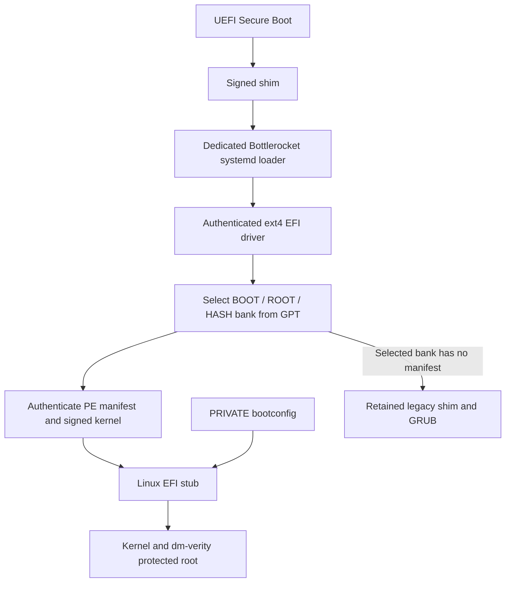
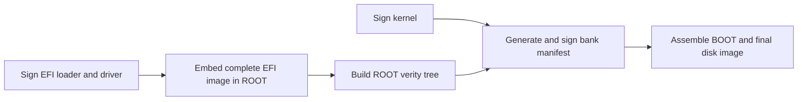
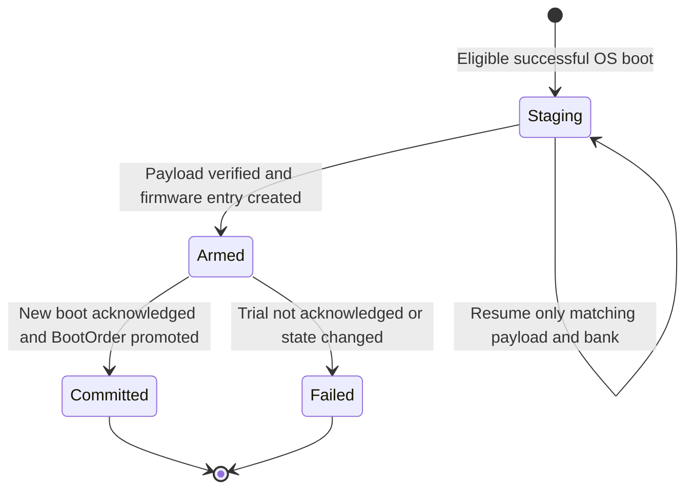

# Authenticated systemd boot for non-UKI A/B images



This design replaces GRUB on an **opt-in, UEFI, non-UKI A/B image** with a dedicated GPT-aware systemd loader. It keeps the kernel separate from the immutable root filesystem, authenticates their relationship through a signed manifest, preserves mutable `settings.boot.*`, and provides an installed-loader transition with recovery through the original EFI partition. Existing variant defaults remain unchanged. The feature is experimental; the validated platform and remaining qualification work are stated below. <sup>[1][2][3][4]</sup>

This document describes Twoliter `6074c7b9f77d65dcdd51a55edcc63b3edb3bc8f4`, core-kit `6213c4831e4bd67b96870ce17bc7af90e4049613`, and kernel-kit `9b352755f73530a70e058b33d2ddd05909417993`. Relative source links refer to this Twoliter tree; cross-member links pin those revisions in local Gitea. The cross-member URL structure is `/jepiyush/<member>/src/commit/<revision>/<source-path>`; readers outside this host can resolve the same member, revision and path in their checkout. Those host-local links must be rewritten before publishing this document elsewhere. See [PCR measurements and prediction](systemd-boot-ab-pcrs.md) for the separate measured-boot design.

## Scope and component ownership

| Component | Responsibility |
| --- | --- |
| Twoliter buildsys | Validate feature combinations; select packages and image behavior. |
| Twoliter image tools and ukisys | Construct/sign EFI payload, kernel and manifest; preserve signing order during repack. |
| Kernel-kit | Supply the shim provider, authenticated ext4 EFI driver and retained GRUB support. |
| Core-kit systemd package | Supply the dedicated loader, GPT bank selection, manifest verification and EFI handoff. |
| Core-kit updog/signpost | Install OS banks, maintain GPT update state, and perform the journaled installed EFI transition. |
| Core-kit prairiedog/rottweiler | Generate mutable bootconfig and perform OS measurements. |
| Variant | Explicitly enable the feature and consume compatible kits. |
| Firmware | Enforce the configured UEFI trust policy and honor BootNext/BootOrder. |

These are separate Git/build boundaries. Updating the image builder alone cannot migrate an already installed loader. <sup>[1][2][3][4][5][6][7]</sup>

The variant's image-feature metadata enables `systemd-boot-ab = true`. Validation requires `uefi-secure-boot = true` and `in-place-updates = true`; it rejects UKI, EIF, standalone and encrypted-storage combinations. There is no BIOS path for new images using this feature. A TPM is not a feature-validation prerequisite: Secure Boot and TPM measurement are different mechanisms. <sup>[1][6]</sup>

For an otherwise compatible variant, the relevant metadata is: <sup>[1]</sup>

```toml
[package.metadata.build-variant.image-features]
systemd-boot-ab = true
uefi-secure-boot = true
in-place-updates = true
```

## Disk model and bank selection

| Disk object | Role |
| --- | --- |
| Original EFI system partition (EFI-A) | Firmware entry point; retained unchanged during an installed migration. |
| Backup EFI partition (EFI-B) | Receives the new EFI image during installed migration; selected through a dedicated firmware entry. |
| BOOT-A / BOOT-B | Kernel, signed manifest for new-format banks, and legacy-compatible boot files in transition images. |
| ROOT-A / ROOT-B | Immutable OS filesystem. |
| HASH-A / HASH-B | Corresponding dm-verity hash tree. |
| PRIVATE | Persistent bootconfig, update state and installed-loader transaction journal. |

The loader discovers partitions on the disk from which its EFI image was loaded. It requires two BOOT, two ROOT, two HASH and one PRIVATE partition. It pairs banks by enumeration order within each partition type, rather than assuming physical adjacency. Migration preserves partition geometry, type GUIDs and partition UUIDs. The legacy test image's partition sizes are fixture properties, not a new disk-layout API. <sup>[2][3][10]</sup>

Fresh images boot the new loader from EFI-A. Installed migration instead retains the old loader on EFI-A and selects new EFI-B through firmware variables. Legacy delegation requires a distinct retained original ESP: the loader refuses to delegate back to its current ESP. Enabling the feature on a fresh image does not itself provide a legacy recovery chain for arbitrary older OS banks. <sup>[2][6]</sup>

BOOT GPT attributes encode priority in bits 48–51, tries in 52–55, and success in bit 56. A bank is eligible when priority is nonzero and either tries remain or success is set. The highest priority wins; enumeration order resolves ties. The new-format path decrements any nonzero try count before execution, even if success is also set; zero tries causes no GPT write. Delegated legacy boots leave retry handling to GRUB. <sup>[2]</sup>

If a boot fails and the selected bank's pre-decrement try count was nonzero, the loader requests a cold reset. It also requests that reset when a delegated legacy application returns with that saved try count nonzero; GRUB owns retry consumption on the delegated path. For a new-format unsuccessful trial, exhausted tries make the bank ineligible, so the next selection uses another eligible bank or reports no bootable bank. A success bit can keep a bank eligible with zero tries; the reset itself is not a universal guarantee of eventual fallback. <sup>[2]</sup>

The GPT reader supports 512- and 4096-byte sectors and validates headers, CRCs, bounds, nonzero/unique partition UUIDs and nonoverlapping extents. A valid primary GPT is authoritative; the backup at the disk's last block is a recovery source if the primary is invalid. Updates write and flush backup entries/header before primary entries/header. Native torn-write tests exercise this ordering, but do not establish physical power-loss guarantees for every storage controller. <sup>[2][10]</sup>

## Authentication and Linux handoff

### EFI execution and the ext4 driver

Firmware verifies shim under its Secure Boot policy. The dedicated shim provider authenticates the Bottlerocket systemd loader and permits the ext4 EFI driver to remain resident. Its driver path delegates loading to firmware using the same authenticated buffer. Shim also uninstalls its `SHIM_LOADED_IMAGE`, `EFI_LOADED_IMAGE` and loaded-image device-path interfaces before freeing an unloaded application, and uses the actual handle in failed-load cleanup. This prevents those interfaces from pointing at freed image storage when a manifest is released or a candidate is rejected. This image-lifetime cleanup is separate from the verification override installed around firmware loading. <sup>[4]</sup>

The loader opens the chosen BOOT filesystem through the driver and verifies the PE manifest. An invalid **present** manifest is a failure; it is not an instruction to fall back to GRUB. The legacy delegation path applies only when the selected bank has no manifest. <sup>[2][3]</sup>

### Signed bank manifest

The manifest is a signed PE image with a `.brconf` section. Its authenticated payload is: <sup>[3][8]</sup>

| Offset | Contents |
| --- | --- |
| 0 | Eight bytes: ASCII `BRBOOT1` followed by NUL. |
| 8 | 32-byte SHA-256 digest of the complete signed kernel file. |
| 40 | NUL-terminated printable ASCII kernel command-line template. |

The template contains exactly one `@ROOT@` and one `@HASH@` token. The loader substitutes the selected partitions' UUIDs, binding the command line to the bank selected from GPT. Fixed flags and the dm-verity table are covered by the manifest signature. The resolved command line must contain fewer than 2048 characters to respect the supported kernels' command-line limit. The loader hashes and authenticates the **same buffered kernel bytes**, avoiding a second file read between verification and execution. <sup>[3][8]</sup>

Input bounds are part of the implementation: the manifest file is at most 1 MiB, its relevant section at most 8192 bytes, the kernel at most 512 MiB, and the bootconfig payload at most 65536 bytes. These are parser limits, not recommendations for target image sizes. <sup>[3]</sup>

### Mutable settings remain separate

Prairiedog renders `settings.boot.*` into PRIVATE bootconfig. The loader exposes that data to the Linux EFI stub through LoadFile2. It validates the bootconfig size, trailer and checksum and rejects an executable initramfs prefix. This allows mutable boot settings without rebuilding the signed kernel or manifest. <sup>[3][7]</sup>

This separation authenticates the fixed command-line bytes; it does **not** implement a semantic allowlist of every bootconfig key. The kernel's command-line/bootconfig precedence and the authorization governing `settings.boot.*` still matter. A checksum is not an authenticity guarantee. The test established that `kernel.printk.time = "1"` survived upgrade and rollback; it did not prove that arbitrary settings cannot affect a security-sensitive kernel option. <sup>[3][7][10]</sup>

On loader entry, the loader attempts to clear the volatile bank acknowledgement so a delegated legacy boot cannot reuse it. Before `StartImage` on the new-format path, it attempts to record the selected bank. Both EFI variable writes are best-effort; a missing marker prevents the installed service from acknowledging a trial. TPM measurements, when available, are described in the companion document; a signature check alone is not proof of an event-log entry or a quoted PCR value. <sup>[3][9]</sup>

## Build, signing and repack order



The complete signed EFI filesystem image is embedded at `/usr/share/bottlerocket/bootloader/efi.img` in ROOT. Therefore the root hash authenticates the exact staging payload later used for installed migration. Only after that payload is final does the builder calculate root verity and sign the manifest containing the kernel digest and verity parameters. The manifest resides on BOOT, outside ROOT; this avoids a circular hash dependency. <sup>[6][8]</sup>

The systemd shim provider installs `shim-systemd-bootx64.efi` on x86_64; the builder moves the provider file to the firmware boot path before signing. This filename distinction caused the first full image build to fail and was corrected before the successful build/repack. <sup>[6][10]</sup>

Repack repeats the dependency order: re-sign EFI, replace the embedded staging image, regenerate ROOT verity, then regenerate/sign the manifest with the new signed-kernel digest. It preserves manifest SBAT data and checks rebuilt section bytes; missing required SBAT is an explicit error. Intermediate images also retain a signed GRUB configuration on BOOT so the old installed loader can boot the new OS before the EFI transition. <sup>[6][8]</sup>

## Installed migration transaction

The installed transition is a **one-time** operation driven by `signpost-bootloader.service`, after `mark-successful-boot.service`. Its payload comes from the authenticated running ROOT, not from an arbitrary update-server file. Installing an OS bank and replacing the firmware-selected loader are separate steps. <sup>[3][9]</sup>



### Stage and arm

The helper checks SecureBoot=1 and SetupMode=0, the expected original/backup EFI layout, a successful running bank, and ownership-sensitive firmware state. It requires an empty backup EFI partition and no preexisting BootNext. It selects an unused Boot1000–Boot1FFF entry that is not referenced by BootOrder. Fresh images already booting the matching dedicated loader need no installed migration. <sup>[3]</sup>

The transaction journal is `PRIVATE/bootloader/transaction.json`, visible in the OS at `/var/lib/bottlerocket/bootloader/transaction.json`. Its sibling `lock` file is held with an exclusive lock. Atomic replacement plus directory synchronization preserves journal updates. The transaction records the payload identity, relevant partition/bank identity, original firmware order, chosen entry and originating boot ID. Staging writes are bounded to the target EFI extent, flushed and read back for verification. The implementation also caps the staging image at 16 MiB. <sup>[3]</sup>

The order is intentional: persist `Staging`; write/verify EFI-B; create the owned firmware entry; persist `Armed`; set BootNext **last**. Original EFI-A remains available. BootNext provides a one-boot trial, rather than permanently changing BootOrder before the new loader demonstrates that it can boot the OS. <sup>[3]</sup>

### Acknowledge and promote

On a subsequent boot, promotion requires a changed boot ID, the same successful bank, the loader's matching volatile bank marker, BootCurrent equal to the owned entry, BootNext consumed, an unchanged owned entry and a matching EFI payload hash. The helper then prepends that entry to the saved original BootOrder and records `Committed`. A service invocation on the same boot is not sufficient. <sup>[3]</sup>

| Interruption or mismatch | Recovery boundary |
| --- | --- |
| Crash while staging | Journal and readback checks determine whether state is recoverable; no unconditional promotion. |
| Crash after arming | BootNext may provide the trial; the next helper invocation must validate the recorded transaction. |
| Interrupted BootOrder promotion | Matching acknowledgement permits completion; otherwise recovery attempts to restore owned state. |
| Foreign entry/order changes | Ownership checks prevent blindly overwriting unrelated firmware configuration. |
| Trial fails to acknowledge, including a missing bank marker after a failed EFI variable write | The OS can boot normally while the transaction becomes terminal `Failed`; original boot path remains the recovery anchor. |

Both `Committed` and `Failed` are terminal states in this implementation. There is no automatic re-arm, comprehensive stale-entry garbage collection, or future EFI/key-rotation protocol. Some handled failures record `Failed` and return exit status 0, so an active/completed systemd unit is **not** proof of a committed migration. Inspect the journal and firmware acknowledgement. The original trust chain must remain accepted by firmware and shim policy for legacy recovery to work. <sup>[3][4][9]</sup>

## Upgrade and rollback runbook exercised locally

The full OS test used `aws-k8s-1.36`, x86_64, local QEMU/OVMF with Secure Boot enabled. The baseline was Bottlerocket 1.63.0; the experimental target was 1.66.0. TUF verification and normal updog bank installation remained in use. A local signed repository supplied the update artifacts. <sup>[5][10]</sup>

1. Boot the original 1.63.0 A bank. Set a persistent datastore sentinel and `settings.boot.kernel["printk.time"] = ["1"]` through the API.
2. Run `updog check-update -a --json`, then `updog update -i 1.66.0 -r -n` in the privileged guest execution context used by the fixture.
3. Reboot into 1.66.0 on B through retained GRUB. Confirm successful-bank state and a transition journal of `Armed`.
4. Reboot again through BootNext. Confirm that the new loader booted B and the actual installed service recorded `Committed`.
5. Run `signpost rollback-to-inactive` and reboot. The dedicated loader selects old bank A, sees no new manifest, and delegates to the retained authenticated legacy shim/GRUB path.
6. Confirm original 1.63.0, persistent settings and SELinux enforcing; compare the preserved partitions and GPT identities with the baseline.

The downgrade in this runbook is **signpost rollback to the retained inactive OS bank**, following an updog upgrade. It is not a second download of an older release through updog. Once delegated, legacy GRUB owns its bank retry handling. A malformed new-format manifest must not silently select that recovery path. <sup>[2][5][10]</sup>

## Validation evidence and limits

| Check | Recorded result and boundary |
| --- | --- |
| Full OS round trip | 1.63.0 → updog 1.66.0 → new-loader acknowledgement → rollback 1.63.0 passed locally with Secure Boot. |
| Persistent state | Sentinel and boot setting survived both directions; SELinux remained enforcing. |
| Disk preservation | Original EFI-A, BOOT-A, ROOT-A and HASH-A byte hashes unchanged; GPT geometry/types/UUIDs unchanged. |
| Build chain | Full local kits, target image and repack passed; both loader package architectures built. |
| Native fault checks | 19 signpost tests; GPT checks included 400 randomized cases and 88 torn writes. These simulate faults, not physical power cuts. |
| EFI rejection/TPM fixtures | Negative authentication tests and a separate minimal Linux/software-TPM fixture passed. This is not full-OS attestation qualification. |
| Prior failures | Initial shim filename build failure and initial TUF target-symlink transport failure retained with subsequent passes. |
| Unfixed runtime messages | Existing `mdadm.shutdown` exit 127 and remaining-device-mapper shutdown messages did not prevent the tested reboots. |
| Excluded qualification | Cloud/EKS, ARM firmware runtime, physical hardware power loss, future loader/key rotation and encrypted-storage sealing. |

The full updog fixture did **not** attach a virtual TPM. The separate firmware fixture verified driver/Linux/systemd measurement events; it did not validate final full-Bottlerocket PCR values or an attestation quote. No default variant switch follows from these tests. All owned guests, servers, firmware-test processes and build containers were stopped after the campaign; fixtures and logs were retained. <sup>[10]</sup>

The baseline compressed image SHA-256 was `2788cc0a74b457a762585beb41de61e125bdf43db5266a16b5fcdcc29198c6c8`; the target was `526efd18ef02f1686dd0e9b5eba54a8603be7880bd5af8dfb0320c237ae1733a`. The baseline source was `d4932ff8af179e982f42f6bbb8e64fa204e3a448`; the target Bottlerocket member was `1ad6b4a40390696d772e9821bb331d25846d4cad` with the feature enabled only in the isolated test checkout. The evidence audit ties build inputs to the reviewed commits; it does not claim earlier images embed later commit IDs. <sup>[10]</sup>

## Conflicts resolved and open boundaries

The former short design did not explain installed state transitions or distinguish TPM-fixture results from full-OS migration. This document makes those boundaries explicit. The PCR README also incorrectly listed PCR 5 as omitted for A/B images; the companion reference documents the actual candidate set. Future firmware qualification, migrated-disk PCR prediction, EFI rotation and full-OS quote validation remain separate work. <sup>[3][10][11]</sup>

## Sources

<sup>[1]</sup> [Image feature validation](../../tools/buildsys/src/manifest.rs), especially `systemd-boot-ab` compatibility checks.

<sup>[2]</sup> Core-kit [GPT selection](http://127.0.0.1:3000/jepiyush/bottlerocket-core-kit/src/commit/6213c4831e4bd67b96870ce17bc7af90e4049613/packages/systemd-257/br-gpt.c) and [boot/delegation](http://127.0.0.1:3000/jepiyush/bottlerocket-core-kit/src/commit/6213c4831e4bd67b96870ce17bc7af90e4049613/packages/systemd-257/br-boot.c).

<sup>[3]</sup> Core-kit [manifest/kernel handoff](http://127.0.0.1:3000/jepiyush/bottlerocket-core-kit/src/commit/6213c4831e4bd67b96870ce17bc7af90e4049613/packages/systemd-257/br-load.c) and [installed transaction](http://127.0.0.1:3000/jepiyush/bottlerocket-core-kit/src/commit/6213c4831e4bd67b96870ce17bc7af90e4049613/sources/updater/signpost/src/bootloader.rs).

<sup>[4]</sup> Kernel-kit [shim provider/patches](http://127.0.0.1:3000/jepiyush/bottlerocket-kernel-kit/src/commit/9b352755f73530a70e058b33d2ddd05909417993/packages/shim) and [ext4 EFI driver](http://127.0.0.1:3000/jepiyush/bottlerocket-kernel-kit/src/commit/9b352755f73530a70e058b33d2ddd05909417993/packages/edk2-ext4).

<sup>[5]</sup> Core-kit [updog](http://127.0.0.1:3000/jepiyush/bottlerocket-core-kit/src/commit/6213c4831e4bd67b96870ce17bc7af90e4049613/sources/updater/updog/src) and [signpost state](http://127.0.0.1:3000/jepiyush/bottlerocket-core-kit/src/commit/6213c4831e4bd67b96870ce17bc7af90e4049613/sources/updater/signpost/src/state.rs).

<sup>[6]</sup> [rpm2img](../../twoliter/embedded/rpm2img), [img2img](../../twoliter/embedded/img2img), and [A/B boot helper](../../twoliter/embedded/ab-boot-helper).

<sup>[7]</sup> Core-kit [bootconfig rendering](http://127.0.0.1:3000/jepiyush/bottlerocket-core-kit/src/commit/6213c4831e4bd67b96870ce17bc7af90e4049613/sources/api/prairiedog/src/bootconfig.rs) and [Linux 6.18 bootconfig documentation](https://docs.kernel.org/6.18/admin-guide/bootconfig.html).

<sup>[8]</sup> [Manifest generation and SBAT-preserving repack](../../twoliter/embedded/ab-boot-helper) and [ukisys manifest stub recovery](../../tools/ukisys/src/main.rs).

<sup>[9]</sup> Core-kit [installed service](http://127.0.0.1:3000/jepiyush/bottlerocket-core-kit/src/commit/6213c4831e4bd67b96870ce17bc7af90e4049613/packages/os/signpost-bootloader.service).

<sup>[10]</sup> Published implementation and testing: [core-kit PR 2](http://127.0.0.1:3000/jepiyush/bottlerocket-core-kit/pulls/2), [kernel-kit PR 1](http://127.0.0.1:3000/jepiyush/bottlerocket-kernel-kit/pulls/1), [Twoliter PR 4](http://127.0.0.1:3000/jepiyush/twoliter/pulls/4). Full local evidence is retained in the assigned grove's `.madden/a2-feedback-3/`: `updog-result.md`, `roundtrip-result.json`, `updog-e2e/`, `prototype/`, and `logs/`. Those paths are local evidence, not remotely downloadable attachments; PR bodies explicitly identify log omissions imposed by the service's body limit.

<sup>[11]</sup> [PCR prediction implementation](../../tools/pcrsys/src/pcrs) and [EFI-A loader detection](../../tools/pcrsys/src/diskfs.rs).

Research basis: source code, upstream reference material and captured local test evidence. Platform and attestation gaps are stated above.
